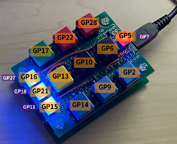

## 環境
種類 | 名称など | 関連リンク
------- | ------- | -------
マイコン | Raspberry Pi Pico
言語 | CircuitPython
大ボタン | 秋月にて1個30円で購入 | [秋月販売ページ](https://akizukidenshi.com/catalog/g/gP-02561/)
小ボタン（LED付） | 秋月にて1個50円で購入 | [秋月販売ページ](https://akizukidenshi.com/catalog/g/gP-13871/)
ユニバーサル基盤 | ベタユニ A8サイズ | [マルツ販売ページ](https://www.marutsu.co.jp/pc/i/837530/)
 

## 概要
各ボタンに以下の機能を実装
* OBSのショートカット
    * 待機画面切り替え
    * VTube画面切り替え
    * リプレイ画面切り替え
    * シーン切り替え（4個）
    * グループ ON / OFF（2個）
* BGM演奏（LEDで表示）
* マイク/音声のミュート
 

## ピン配置

